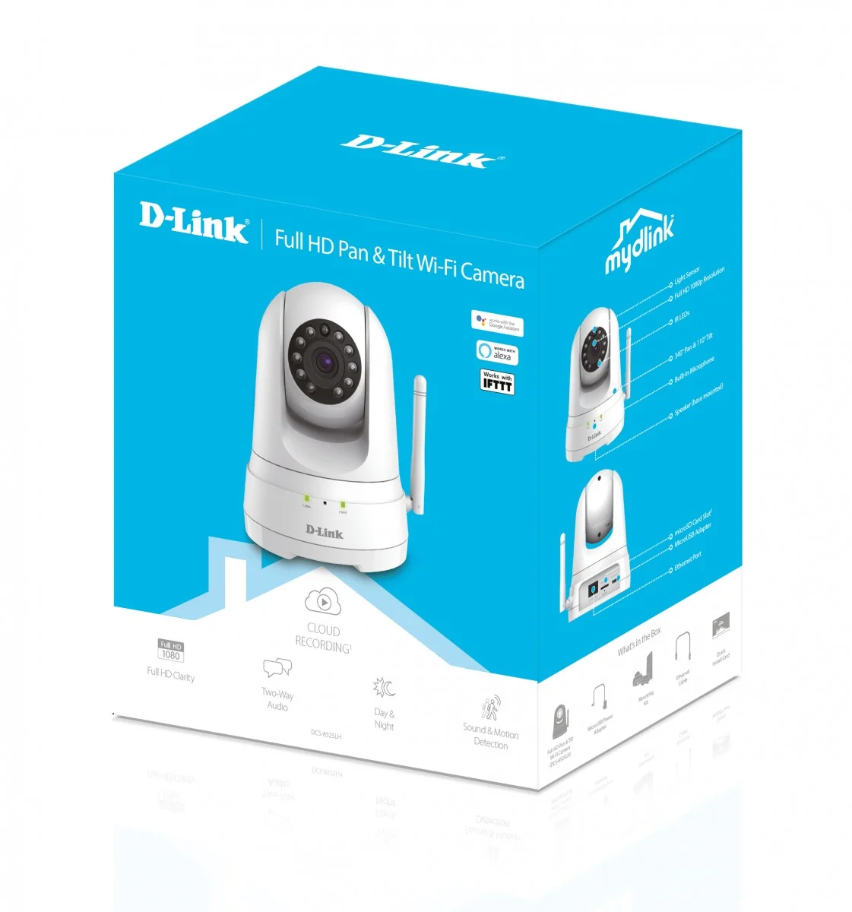
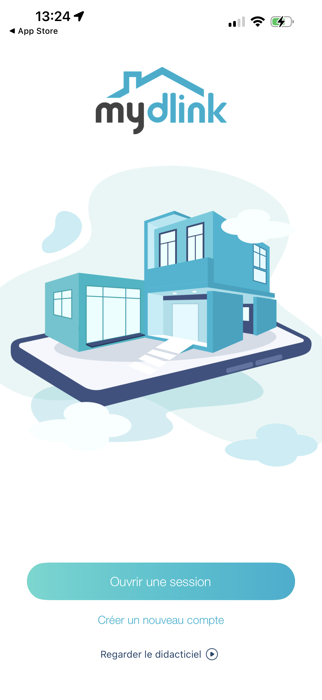
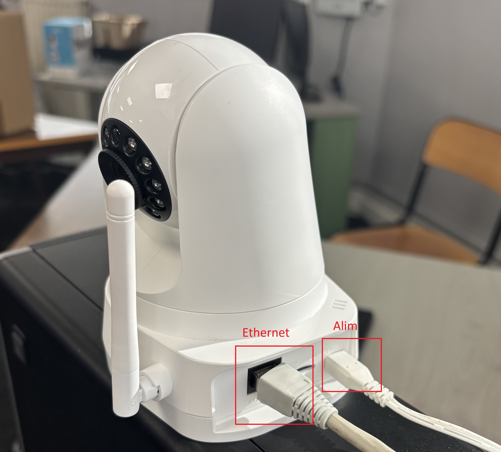
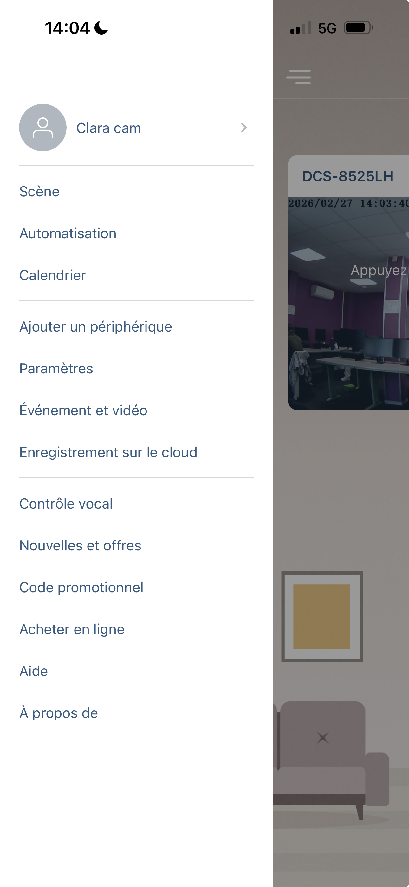

# 📹 Installation et Configuration d'une Caméra IP (D-Link DCS-8525LH)

## 📌 Sommaire
1. [Présentation du Projet](#-présentation-du-projet)
2. [Matériel et Prérequis](#-matériel-et-prérequis)
3. [Procédure d'Installation](#-procédure-dinstallation)
4. [Analyse des Modes de Connexion](#-analyse-des-modes-de-connexion)
5. [Interface et Fonctionnalités](#-interface-et-fonctionnalités)
6. [Bilan et Critique Professionnelle](#-bilan-et-critique-professionnelle)
7. [Spécialité SISR : Sécurité et Réseau](#-spécialité-sisr--sécurité-et-réseau)

---

## 📋 Présentation du Projet
**Objectif :** Mme JOUVET souhaite mettre en place une solution de vidéosurveillance simple et performante. Nous lui avons recommandé le modèle D-Link DCS-8525LH pour sa mobilité et sa gestion intuitive via smartphone.
 
 
Dans le cadre de ce TP, nous allons détailler les étapes d'installation et de configuration de l'équipement. Nous réaliserons également une analyse comparative des modes de connexion (Wi-Fi et Ethernet) afin d'identifier leurs limites techniques respectives en termes de stabilité et de sécurité.

> [!NOTE]
> **Photo 1 :** Modèle D-Link DCS-8525LH sélectionné pour l'installation.
---

## 🛠️Contenu de la boîte : 
* **Caméra :** Full HD 1080p.
* **Câble réseau:**  Ethernet (RJ45).
* **Bloc d’alimentation** 
* **Support de fixation**
* **Chevilles**
* **Guide rapide + carte avec QR code.**

---

## ⚙️ Procédure d'Installation

### 1. Installation physique
* Choix de l'emplacement et branchement de l'alimentation.
* **Le Reset (Étape cruciale) :** Si la caméra a déjà été configurée sur un autre appareil, elle est bloquée. Il faut alors la réinitialiser avec un trombone en appuyant sur le bouton **Reset** à l'arrière pendant **10 secondes**, jusqu'à ce que la **LED clignote en rouge**.

### 2. Configuration logicielle
1. **Scan du QR Code boîte :** On scanne le code sur le boîtier pour être redirigé vers le téléchargement de l'appli **mydlink**.
2. **Création du compte :** On crée son profil utilisateur (indispensable pour accéder à la caméra à distance).

3. **Connexion de la caméra :** On lance l'ajout, on scanne le QR Code sous l'appareil et on choisit la connexion **Ethernet**.
4. **Finalisation :** On termine en donnant un petit nom à la caméra (ex: "Clara cam").

---

## 📊 Analyse des Modes de Connexion

| Mode | Avantages | Inconvénients |
| :--- | :--- | :--- |
| **Ethernet** | ✅ Ultra-stable, latence minimale, haute sécurité. | ❌ Nécessite un câble, moins flexible. |
| **Wi-Fi** | ✅ Installation rapide, placement libre. | ❌ Sensible aux interférences. |

*Photo 2 : Détail du branchement combiné (Alimentation secteur + Câble Ethernet RJ45).*

---

## 📱 Interface et Fonctionnalités (Le Menu)

Voici le panneau latéral de l'application **mydlink** qui permet de gérer la "Clara cam". Chaque option a un rôle précis :

* **Scène :** Permet de créer des profils (Maison, Absent, Sommeil) pour changer le comportement de la caméra en un clic.
* **Automatisation :** C'est ici qu'on règle les déclenchements automatiques (ex: enregistrer si un mouvement est détecté) *(uniquement premimum)*.
* **Calendrier :** Pour revoir les événements passés en choisissant une date précise.
* **Paramètres :** Accès aux réglages techniques (nom du périphérique, fuseau horaire, Wi-Fi).
* **Événement et vidéo :** Historique de toutes les alertes reçues.
* **Enregistrement sur le cloud :** Gestion du stockage des vidéos en ligne.

---

## 📝 Bilan et Critique Professionnelle

### Points positifs
L'installation est fluide et l'interface très intuitive pour un utilisateur n'ayant pas de profil IT , grace au guidage par QR Code.

### Limites techniques
La stabilité en Wi-Fi dépend fortement de l'environnement. Pour une installation fixe, le mode filaire reste la meilleur solution.

---
